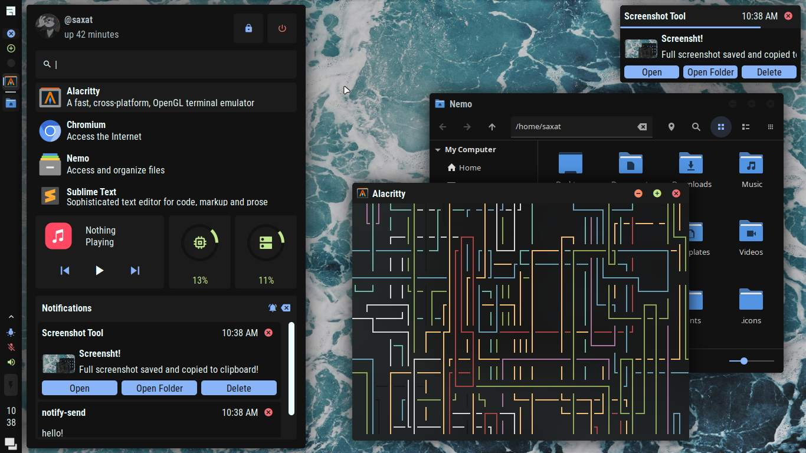
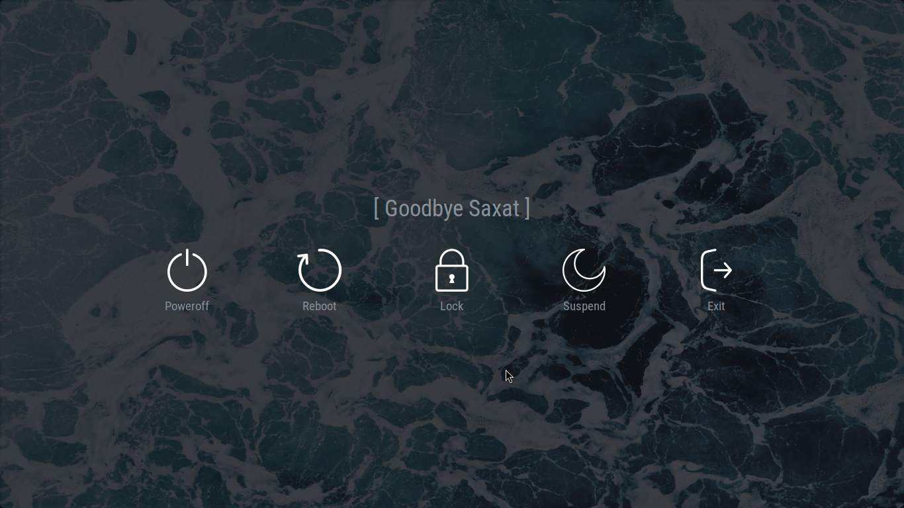

## AwesomeWM Config

#### Features
- Tab Switcher (Alt+Tab)
- Lock Screen (Shift+Alt+x)
- Exit Screen (Super+Esc)
- Sidebar/App Launcher (Super+r)

#### Requirements
- [Material Design Iconic Font](https://zavoloklom.github.io/material-design-iconic-font/)
- [Roboto Condensed Font](https://fonts.google.com/specimen/Roboto+Condensed)
- playerctl (Media)
- brightnessctl (Brightness)
- NetworkManager (Wifi)
- pamixer & pactl (Audio)
- UPower (Battery)
- Gpick (Color Picker)
- Maim (Screenshot)

#### Installation
- Install dependencies
- git clone https://github.com/SaxatB/AwesomeWM.git --recurse-submodules
- Copy this cloned directory's content to ~/.config/awesome/

#### Post-Installation
- Add your own background in `backgrounds/` and change in `themes.lua`
- Change `assets/pfp.jpg`
- Change `config.lua` based on your own system
- Change the pinned apps for the launcher in `components/sidebar/modules/launcher.lua`
- Change the location for weather in `daemons/weather.lua`

#### Misc
- Theme is Material Dark(er), you can change it in `themes.lua`
